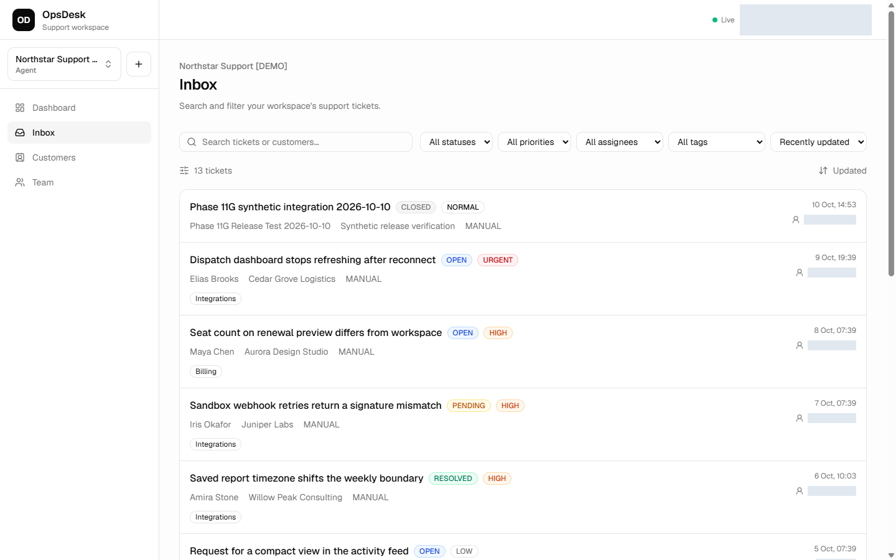
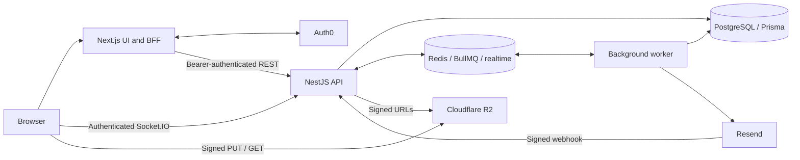

# OpsDesk

Multi-tenant support software for managing customers, ticket conversations, team workload, and email delivery in one workspace. Built as a TypeScript monorepo with a Next.js frontend, a NestJS API, and a separate background worker.

[Staging app](https://opsdesk-web-staging.up.railway.app/app) · [Architecture](docs/architecture.md) · [Security](docs/security.md) · [API & OpenAPI](docs/api/README.md) · [Deployment](docs/deployment.md)

The staging app requires an authorized Auth0 account and workspace membership. Access details are shared privately. The screenshot below is from the actual **Northstar Support [DEMO]** workspace after Phase 11G; customer records are synthetic. Account, email and assignee identities were masked during capture. [Mobile screenshot](docs/images/phase-11g-mobile.png).



## Features

- Customer profiles, search, pagination, and archive/restore workflows.
- Tickets with status and priority filters, tags, assignments, public replies, and internal notes.
- Organization switching and four membership roles: Owner, Admin, Agent, and Viewer.
- Signed attachment uploads/downloads through Cloudflare R2, with size/type limits and cleanup jobs.
- Resend inbound email and queued outbound replies, with delivery lifecycle tracking and webhook deduplication.
- Socket.IO updates across API and worker instances through Redis.
- UTC analytics for 7, 30, and 90 days, including ticket trends, workload, customer counts, and email delivery metrics.
- Tenant-scoped audit history, readiness probes, queue health signals, and worker heartbeats.

## Architecture



REST browser calls go through the Next.js backend for frontend (BFF). The API independently verifies Auth0 access tokens, resolves organization membership, checks role permissions, and scopes resource queries by organization. The realtime connection uses a dedicated BFF token endpoint and performs its own membership and ticket-room checks. See [the auth flow](docs/security.md#authentication) for that distinction.

| Layer | Stack |
| --- | --- |
| Web | Next.js 16, React 19, Tailwind CSS 4, shadcn/Base UI, TanStack Query, Recharts |
| API | NestJS 12, TypeScript, class-validator, OpenAPI via `@nestjs/swagger` |
| Data | PostgreSQL, Prisma 7 with the PostgreSQL adapter |
| Async & realtime | Redis, BullMQ, Socket.IO, Redis adapter/emitter |
| Providers | Auth0, Cloudflare R2, Resend |
| Tooling | pnpm 10.15.1, Turborepo, Jest, Supertest, ESLint, Oxlint, GitHub Actions, Docker |

## Local development

Use Node.js **22.22.3 or newer within the 22.x line** and pnpm **10.15.1** (matching CI's Node 22 / pinned pnpm). Docker is convenient for isolated PostgreSQL and Redis. Auth0 and the provider credentials required by the API environment validator must be configured privately for a full running app. Documentation generation and most unit checks need no provider credentials.

From the repository root, copy the committed templates:

```powershell
Copy-Item apps/api/.env.example apps/api/.env
Copy-Item apps/web/.env.example apps/web/.env.local
Copy-Item compose.env.example compose.env
pnpm install --frozen-lockfile
```

Fill in your **development** values. In `compose.env`, set a local PostgreSQL password. Set `apps/api/.env`'s `DATABASE_URL` to the matching `opsdesk` user/database on `127.0.0.1:5433`; keep Redis at `127.0.0.1:6379`. Do not point local migration or test commands at staging or production. Keep the audience identical between the API and web templates. Configure Auth0's local callback URL `http://localhost:3000/auth/callback` and allowed logout/web origin `http://localhost:3000`.

| File | Configuration |
| --- | --- |
| `apps/api/.env` | DB/Redis URLs, Auth0 issuer/audience, web origin, R2 credentials/bucket, Resend keys/signature secret, sender and inbound domain |
| `apps/web/.env.local` | Auth0 application credentials/session secret, app URL, private API URL, public realtime/R2 origins |
| `compose.env` | Local infrastructure ports/password and image build values |

`NEXT_PUBLIC_*` values are public and embedded at build time. Never put secrets in them. `.env` files are ignored by Git; templates contain placeholders. For a full provider setup, use dedicated development resources and approved existing plans; this project does not require a paid upgrade as part of the documentation workflow.

Start only the local infrastructure, then generate the client and apply committed migrations to that local database:

```powershell
docker compose --env-file compose.env -f compose.docker.yml up -d postgres redis
pnpm --filter api exec prisma generate --config prisma7.config.ts
pnpm --filter api migrate:deploy
```

Run these in separate terminals:

```powershell
pnpm --filter api dev
pnpm --filter api dev:worker
pnpm --filter web dev
```

Open `http://localhost:3000`. API readiness is at `http://localhost:3001/health/ready`. To author a new database migration, use `prisma migrate dev --config prisma7.config.ts` only against your disposable local development database.

## Checks and API documentation

```powershell
pnpm --filter api lint
pnpm --filter api build
pnpm --filter api test
pnpm --filter api test:e2e
pnpm --filter api test:openapi
pnpm --filter api openapi:generate
pnpm --filter api openapi:check
pnpm --filter web lint
pnpm --filter web test:auth
pnpm --filter web test:security
pnpm --filter web build
```

API E2E tests require isolated Redis and the synthetic environment described in [API documentation](docs/api/README.md#verification). Real database suites are opt-in and require a disposable test database; see [CI](.github/workflows/ci.yml) for the complete environment and commands. Never run them against a deployed database.

[The OpenAPI snapshot](docs/api/openapi.json) documents all 38 HTTP operations, including health and existing v1 routes. Generation uses controller metadata and inert service mocks, opens no listening socket, and does not connect to the database, queues, or external providers. The optional Swagger viewer is a separate development-only process bound to `127.0.0.1:3100`, with Try it out disabled. Staging/production API entrypoints install no documentation routes. [Usage and safeguards](docs/api/README.md#openapi-and-local-swagger).

GitHub Actions checks API lint/build/unit tests, E2E/realtime/security, PostgreSQL integration, web lint/auth/security/build, OpenAPI drift, and Docker images. It runs on PRs to `master` and `feat/phase-11-deployment`. A passing local check is separate from a passing hosted workflow.

## Deployment and current limits

Railway staging runs the web, API, and worker from `feat/phase-11-deployment`, with separate PostgreSQL and Redis services. See [deployment configuration](docs/deployment.md) and the [operations runbook](docs/operations/runbook.md).

The [Phase 11G final verification](docs/demo/PHASE-11G-FINAL.md) records the completed staging portfolio release; the [full report](docs/PHASE-11G-REPORT.md) contains detailed evidence and release gates. Live checks verified a real nonmember's BFF/API 404, synthetic ticket mutations, actual realtime propagation and reconnect recovery, an R2 upload/download, and a controlled Resend outbound/inbound round trip. Four retained failed email jobs were traced to Resend's development sender restriction; they were preserved. Monitoring now distinguishes retained history from consumer health, and provider failures expose only allowlisted codes and bounded HTTP statuses.

The [Phase 11E report](docs/demo/FINAL-VERIFICATION.md) remains the historical seed baseline: 8 customers, 12 tickets, 5 tags, and 48 messages. Phase 11G added a separately named disposable customer/ticket and messages; baseline counts are not a claim about today's mutable workspace. Staging uses Resend's development sender and an approved test recipient. Arbitrary customer delivery requires a verified sending domain and a new controlled check. See [release notes](docs/RELEASE-NOTES.md) and the [production checklist](docs/PRODUCTION-READINESS.md).

Other boundaries: invitation links are returned for manual sharing; no automated invitation email workflow is claimed. OpenAPI does not model Socket.IO events or all business rules. The attachment pipeline checks policy and object metadata but does not implement malware scanning. Backup restoration and production readiness have not been certified by this staging exercise. Review the exact diff and passing CI before a staging merge. Production/default-branch release requires separate authorization.

## Repository guide

| Path | Purpose |
| --- | --- |
| `apps/web` | UI, Auth0 session handling, BFF routes, web security tests |
| `apps/api/src` | REST API, tenancy/RBAC, realtime, jobs, integrations |
| `apps/api/src/worker.ts` | Separate queue worker entrypoint |
| `apps/api/prisma` | Schema and committed database migrations |
| `apps/api/scripts` | Offline OpenAPI generation and local viewer safeguards |
| `docs` | Architecture, security, API workflows, deployment, operations, demo verification |
