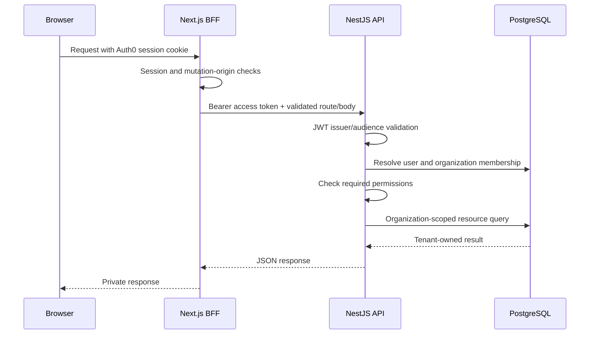

# Architecture

OpsDesk is a pnpm monorepo. Next.js renders the application and provides authenticated browser-facing API routes. NestJS owns business rules and persists data through Prisma's PostgreSQL adapter. The worker runs independently from the HTTP API.

## Request path

The API treats `organizationId` as a selector, not proof of authorization. Tenant context contains the internal user, organization, membership, and role. Services include the organization boundary when looking up child records. This is application-enforced isolation; the project does not claim PostgreSQL row-level security. Auth0 identity and OpsDesk membership are distinct concepts.

## Data and modules

The main entities are User, Organization, Membership, Invitation, Customer, Ticket, Tag/TicketTag, Message, Attachment, EmailDelivery, WebhookEvent, and AuditEvent. An authenticated identity can hold different roles in different organizations. Ticket assignment references a membership, not a global user ID. Resource relationships are validated within the active organization.

Modules separate customers, tickets/messages, tags, team/invitations, attachments, analytics, audit, email, tenancy, RBAC, health, and realtime. Existing services contain the workflow rules; Swagger metadata only describes those rules. Runtime entrypoints remain `main.ts` and `worker.ts`.

## Asynchronous processing

Public replies to customers with an email address persist outbound delivery state and enqueue work on BullMQ's `email` queue. Internal notes do not send email. The worker calls Resend and records delivery results. Signed webhook events reconcile delivery status and ingest inbound mail; deduplication prevents repeated event handling. Recovery reconciles pending delivery records with queued work.

The `maintenance` queue schedules cleanup tasks for attachments. Both consumers publish heartbeats. API queue health sampling reports backlog, retained failures, pause state, and fresh consumers. `consumerStatus` separates worker/pause/backlog health from retained failure history; the overall degraded warning remains visible. `retainedFailureTrend` compares successful samples in memory and resets on process restart. A net count trend is not a failure rate. API readiness checks PostgreSQL/Redis availability, independently of worker and provider health. See [the runbook](operations/runbook.md) for signal meanings and recovery precautions.

Provider errors pass through an allowlist before diagnostic logging. The email service attaches only a documented code and bounded HTTP status; the worker logs those plus retry/final-attempt flags before BullMQ wraps a permanent failure. Raw provider responses stay out of application diagnostic events because they can contain recipients or secrets. This improves diagnosis without changing retry, idempotency or authorization decisions.

## Attachments

The API authorizes an upload against a tenant-owned ticket, validates type/size policy, persists a pending attachment, and issues a short-lived signed R2 PUT URL. The browser uploads directly to R2 with the returned headers. Completion checks the object before marking it uploaded; message creation validates attachment ownership and limits. Authorized downloads issue signed GET URLs. Pending and unlinked objects are cleaned by maintenance jobs. Signed URLs are sensitive and should not appear in logs or screenshots.

## Realtime

Socket.IO uses namespace `/realtime`. The connection verifies an Auth0 access token and joins a user room. Organization and ticket room joins validate UUIDs and membership; a ticket join re-resolves membership/permissions and requires the organization to have been joined first. Leaving an organization also leaves its ticket rooms.

Redis's Socket.IO adapter and emitter allow API and worker instances to publish updates across instances. The web client invalidates/refetches relevant query data on ticket, message, and delivery events. A live connection alone does not prove propagation. [Phase 11G](PHASE-11G-REPORT.md) observed ticket creation, notes, an attachment and an actual inbound reply reaching an open owner session without reload. [Event contract](api/README.md#socketio-events).

After reconnecting, the client waits for the authorized organization-room join acknowledgment before refreshing active realtime-backed ticket lists/details, customer ticket histories and analytics for that organization, marking their inactive caches stale. Other workspaces and customer/team/settings queries are excluded. Ticket-message data is reconciled separately after a successful ticket-room acknowledgment. Subscribing before reading a fresh snapshot covers writes during the reconnect gap. A denied organization join triggers no recovery fetch; a denied ticket join adds no message refresh, although the preceding successful organization acknowledgment can already have refreshed its permitted ticket metadata. Every refetch still passes API authorization. The initial connection avoids this extra refresh. A stable recovery notification ID prevents repeated reconnects from accumulating notices. This restores data consistency after interruption; it does not guarantee uninterrupted transport.

## Analytics

The overview uses UTC day buckets for `7d`, `30d`, or `90d`. Current totals/status/priority distributions and active workload are snapshots; created/resolved trends and period email metrics use the requested range. They should not be interpreted as identical time scopes. Resolution counts include the applicable resolved/closed lifecycle records. Analytics queries and audit pagination remain tenant-scoped.

## Deployment boundary

Web, API, and worker are separate Railway services. API and worker share environment-specific PostgreSQL and Redis; web calls the API through its server URL and uses public origins for browser realtime/R2 traffic. Docker has separate runtime and migration targets. See [deployment](deployment.md) for environment variables, build-time values, migration ordering, and release impact.
